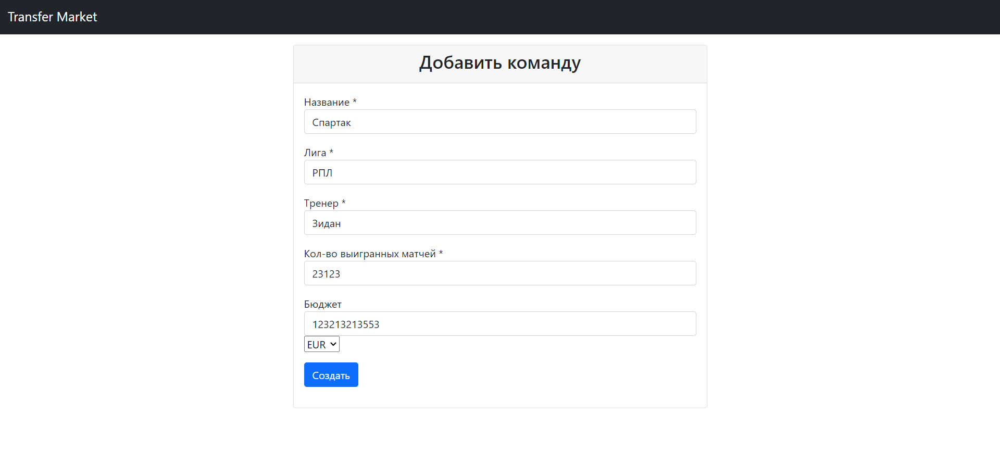

# Football transfer market
Над курсовой работали:
* [Андрей Васильев](https://github.com/wizarsi)
* [Максим Васильев](https://github.com/bball30)

Стек технологий: Java 17, Spring (Boot, Data, Security), Thymeleaf, PostgreSQL, Maven

**Предметная область:**

Трансферный рынок футболистов

**Описание:**

Трансферный рынок - это площадка, для совершения сделок, проводимых в период, специально отведенный для покупки и продажи игроков (трансферное окно).

Менеджеры команд, которые хотят продать игроков, выставляют их на трансферный рынок, указав минимальную цену, за которую они готовы продать игрока. Менеджеры, которые хотят купить игроков, находят их на трансферном рынке, оставляют заявки на покупку с указанием цены, за которую они готовы купить игрока, его зарплату и срок нового контракта.

Если у игрока заканчивается контракт с клубом, в котором он состоит, и этот клуб не предложил ему новый контракт, то игрок становится свободным агентом (игрок без клуба).

Если клуб хочет приобрести игрока с действующим контрактом, то этот клуб обязан заплатить отступные, которые прописаны в контракте футболиста.

Команды могут обменяться игроками. В данном случае клуб вместо цены за интересующего их игрока предлагают своего футболиста.

Спортивный директор клуба должен зарегистрироваться, указав клуб, лигу, в которой клуб играет, бюджет клуба и количество игроков в команде. Также необходимо зарегистрировать каждого игрока, указав возраст, позицию, на которой играет, игровую статистику в формате «количество игр:забитые голы:голевые передачи», а также информацию о действующем контракте (клуб, зарплата, отступные).

Контракт заключается с игроком и клубом. При продаже игрока, между клубами может быть договоренность о праве на приоритетный выкуп, в случае выставления игрока на трансфер. Агент игрока договаривается о з/п, сроках, условиях.

В информацию о команде на трансферном рынке входит тренер. Его уровень определяется количеством выигранных матчей и завоеванным кол-м трофеев.

У каждого клуба есть валюта, в которой он будет принимать оплату за своих игроков. Конвертация валют происходит в соответствии с курсом, зафиксированным в момент предложения трансфера, то есть в момент заключения сделки зафиксированный курс может отличаться от фактического.

Между трансферными окнами проходит симуляция футбольных матчей (количество матчей фиксировано для каждой лиги). Игроки набирают статистику согласно своему рейтингу, возрасту и тренеру клуба. После окончания игрового сезона у футболистов увеличивается или уменьшается их рейтинг, который зависит от количества забитых голов и отданных голевых пасов.

Игроки, которых не купили до закрытия трансферного окна, автоматически попадут в следующее окно.

Таким образом совокупность всех таблиц направлена на удобный поиск игроков для трансферов.

**Стержневые сущности:**
1. клубы
2. футбольные лиги
3. игроки
4. тренеры
5. Спортивный директор
6. предложения обмена
7. предложения трансфера
   Ассоциативные:
1. игроки клуб
2. футбольный клуб и лига
   Характеристические:
1. статистика тренера
2. статистика игроков
3. курсы валют относительно рубля(стоимость) (самая стабильная валюта в мире).
4. контракты футболистов
   Инфологическая модель:

**Даталогическая модель:**

**3 этап.**

Триггеры и функции:
1. Если у игрока заканчивается контракт, то функция выставляет его на трансферный рынок(поле клуб становиться null), при добавлении контракта устанавливать его игроку и - функция триггер.
2. Функция для подсчета трат на зарплаты футболистов одного клуба
3. Функция выводит игроков трансфера с столбцом transfer_possible по таблице контрактов смотрится стоимость
4. Когда добавляется футбольный клуб, устанавливается id football_clubs в таблице sport_directors
5. 2 тригера для статистик игрока и тренера, считается рейтинг для таблиц игроков и тренеров
6. Триггер при добавлении тренера устанавливать его в таблице футбольных клубов

Наиболее часто используемые запросы:
Наши пользователи чаще всего обращаются к таблице players. Это обусловлено тем, что в ней содержится основная информация об игроках. С помощью нее удобно найти подходящего игрока для трансфера. Проанализировав написанные функции, также можно убедиться в том, что таблица players является наиболее востребованной.

Индексы:
* Дополнительно добавляем индекс на внешний ключ contract, так как по этому ключу игрок будет часто  идентифицироваться.
* Добавляем индекс на внешний ключ player_id, так как по этому ключу контракты будут искаться часто
* Так как спортивный директор один на клуб, то поиск подходящего по id клуба в нашей бизнес логике будет происходить именно по этому столбцу.

Исходный код, по-которому создали БД в 3 этапе: https://github.com/wizarsi/course-work-stage-3

**Этап 4.**

Страницы:
1. Авторизация (по спортивному директору)

2. Выбор действий:

      2.1 Игроки(статистика, все команды)

      2.2 Моя команда(Поменять тренера)

      2.3 Трансферы(обмен, деньги)

3. Главная страница
